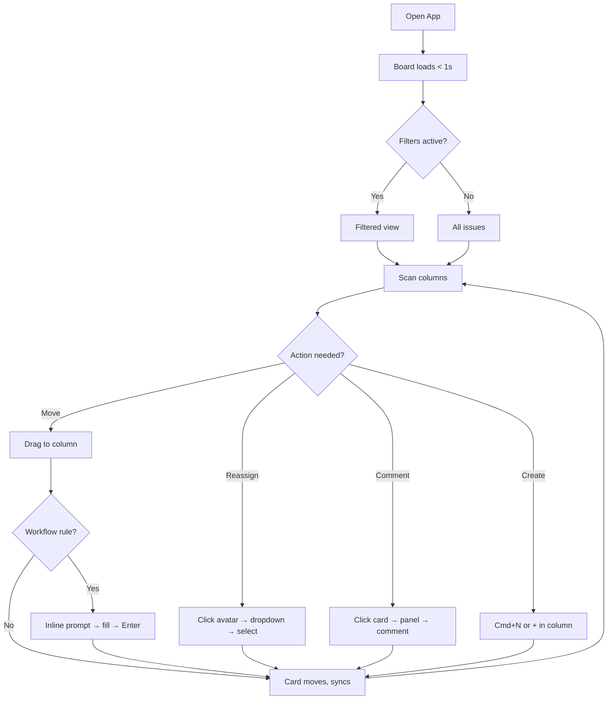
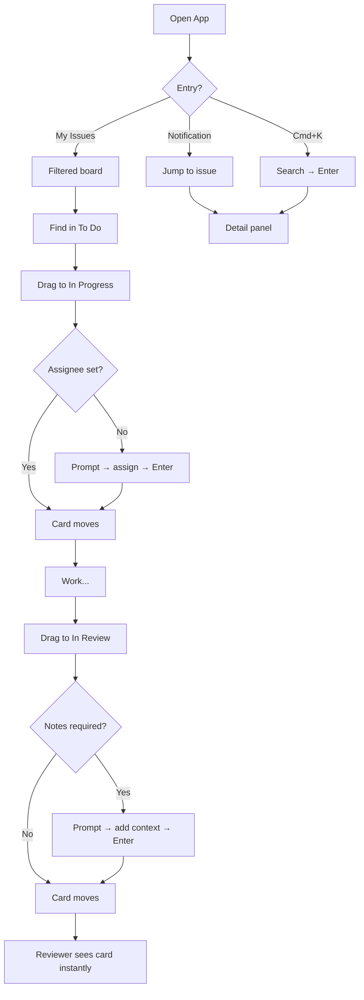
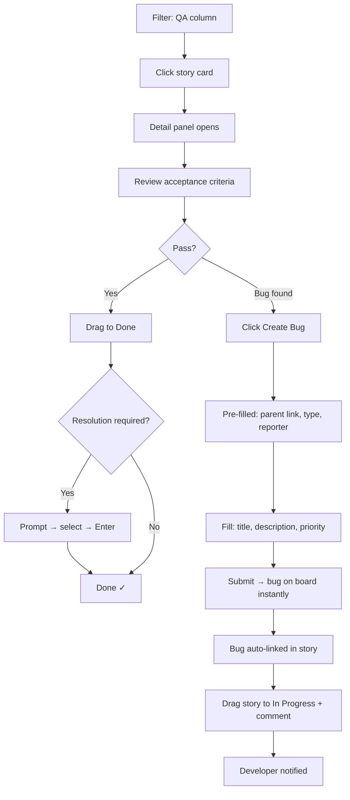
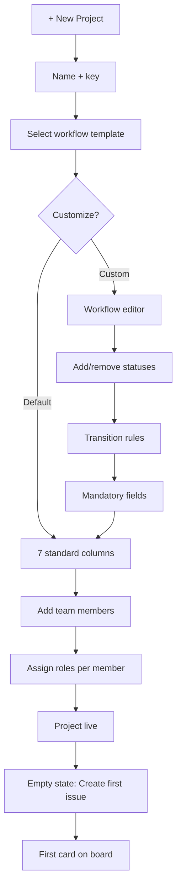

# UX Design Specification — Mega Jira 3000

**Author:** Diyor
**Date:** 2026-04-09

---

## Executive Summary

### Project Vision

Mega Jira 3000 is a real-time SDLC project management platform for enterprise engineering organizations (10,000+ users). The MVP delivers core issue tracking, Kanban board management, and workflow enforcement — built for speed and information density. No 3rd party integrations. Every interaction must feel instant (< 200ms API, < 100ms visual feedback on drag).

The UX follows the **Asana-Prime** design philosophy: information density maximized, typography-driven hierarchy, functional stoicism, zero decorative elements. **Web-first** — desktop 1440px+ as primary breakpoint, optimized for vertical scanning and multi-panel layouts.

### Target Users

**Planner (PM):** Power user who lives in the board view. Manages sprints across multiple teams, tracks velocity, unblocks dependencies. Needs: multi-filter views, real-time board state, fast issue reassignment, comment threading.

**Executor (Developer):** Creates and transitions issues, adds comments and review notes. Needs: minimal friction workflows — drag to transition, inline comment, keyboard shortcuts. Zero tolerance for unnecessary clicks.

**Gatekeeper (QA):** Validates stories against acceptance criteria, creates bugs from within story context. Needs: fast bug creation with auto-linking, mandatory field enforcement that doesn't break flow, clear issue relationships.

**Admin (System/Project Admin):** Configures workflows, roles, SLA rules, notification preferences. Needs: clear settings UI with progressive disclosure, audit trail visibility, RBAC configuration that's visual not table-driven.

### Key Design Challenges

1. **Board density vs. readability.** Kanban cards must show issue key, title, assignee, priority, and type in a compact form. Maximize data per card while maintaining scannability during standups. Tight type scale with clear visual weight hierarchy.

2. **Workflow enforcement without flow disruption.** Transition rules (e.g., mandatory Root Cause for Bug → Done) interrupt drag-and-drop. Solution: lightweight slide-over prompts or inline panels — not heavy modals that break spatial context.

3. **Real-time conflict resolution.** When two users edit the same issue (409 Conflict), the UI must clearly show what changed without alarming the user. Inline diff with "Review changes" action — not a Git-style merge conflict.

4. **Filter complexity without a query language.** MVP uses structured filters instead of MJQL. Must support combining status + assignee + type + priority + date range with saved presets. Dropdown/chip-based filter bar — powerful but not intimidating.

### Design Opportunities

1. **Keyboard-first power user experience.** Cmd+K command palette, keyboard shortcuts for status transitions (e.g., `I` for In Progress, `R` for In Review), quick-create via shortcut. Differentiates from sluggish legacy tools.

2. **Issue detail as centered modal with permalink.** Jira-style: clicking an issue opens a centered modal (`max-w-3xl`, ~960px) over a darkened backdrop. Click-outside or Esc closes it. The issue key in the modal header is a real anchor link to `/projects/[key]/issues/[issueKey]` — Cmd/Ctrl+Click opens the issue on its own dedicated page (full-bleed view of the same `IssueDetailPanel` body), enabling shareable URLs and multi-tab workflows. *(Updated 2026-04-15 — was originally a 480px right-side slide-over; the slide-over caused a cramped two-column field grid at lg and didn't support shareable links.)*

3. **Progressive disclosure in admin settings.** Workflow customization layered: simple defaults first, advanced configuration (transition rules, mandatory fields) on demand. Admin shouldn't need a manual.

## Core User Experience

### Defining Experience

**The ONE interaction that defines Mega Jira 3000: the Board.**

The Kanban board is where all four MVP personas converge. PMs scan it for blockers. Developers drag issues to transition status. QA checks the QA column for work. Admins verify workflows are functioning. If the board feels instant, dense, and alive — the product wins. If it feels sluggish or sparse — nothing else matters.

**Core loop:** Open board → scan columns → act on an issue (drag, click, comment) → see real-time update → repeat. This loop happens 50-100 times per day per active user. Every millisecond of friction compounds.

### Platform Strategy

- **Primary:** Desktop web browser (Chrome, Firefox, Safari, Edge). Target viewport: 1440px+.
- **Layout:** Multi-panel — persistent left sidebar (project navigation), central board/list area, right slide-over panel (issue detail). This three-panel structure maximizes information density without losing context.
- **Input:** Mouse + keyboard as co-equal. Drag-and-drop for board transitions. Keyboard shortcuts for everything else. No touch optimization in MVP.
- **Offline:** Not supported in MVP. Real-time sync is a core differentiator — offline would undermine it.
- **Responsive:** Functional down to 1024px (tablet landscape). Below that, deferred.

### Effortless Interactions

1. **Drag to transition.** Grab a card, drop it in a column. Status updates. Board syncs. Done. If a transition rule fires, a lightweight inline prompt appears — not a full-screen modal.

2. **Click to inspect.** Click any issue → detail panel slides in from the right. Full context (description, comments, attachments, linked issues, activity log) without leaving the board. Press `Esc` to close.

3. **Cmd+K to do anything.** Command palette for power users: create issue, switch project, jump to issue by key (MEGA-55), filter by assignee. Eliminates menu diving.

4. **Real-time without refresh.** When a teammate drags a card, it moves on your screen instantly. New comments appear without polling. The board is alive — users should never hit a refresh button.

5. **Filter without thinking.** Click filter chips at the top of the board: Status, Assignee, Type, Priority, Date. Chips stack. Saved presets accessible via dropdown. Clear all with one click.

### Critical Success Moments

1. **First board load (TTFV < 15 min).** Admin creates project → adds team → board appears with default workflow columns. First issue created and dragged to "In Progress" within minutes. If this takes longer than 15 minutes, onboarding fails.

2. **First real-time sync.** User A drags a card. User B sees it move on their screen without refreshing. This is the "this is different" moment — the instant where the product proves its performance promise.

3. **First workflow enforcement.** Developer drags a Bug to "Done" → system prompts for Root Cause. Must feel helpful ("we need this for quality tracking"), not punitive ("you can't do that"). The prompt completes in 2 clicks, not 5.

4. **First standup with live board.** PM shares screen during standup. Board is already current — no one spent 10 minutes updating tickets before the meeting. Standup finishes in 8 minutes. This is the retention moment.

### Experience Principles

1. **Speed is the feature.** Every interaction must feel instant. Optimistic UI updates before server confirmation. Skeleton loaders, not spinners. If the user notices latency, we've failed.

2. **Density over whitespace.** Show more data, not less. Tight type scale, compact cards, minimal padding. Power users want to see 30 issues on screen, not 8. Scrolling is friction.

3. **Context preservation.** Never navigate away from the board to see detail. Slide-over panels, inline editing, stacked modals — the board is always one `Esc` away.

4. **Keyboard parity.** Anything you can do with a mouse, you can do with a keyboard. Cmd+K as the universal entry point. Tab navigation through columns. Enter to open, Esc to close.

5. **Progressive complexity.** Simple by default, powerful on demand. Filters start as chips, expand to advanced. Admin settings start with defaults, reveal configuration layers. New users aren't overwhelmed; power users aren't limited.

## Desired Emotional Response

### Primary Emotional Goals

**In Control.** Users should feel like they have complete situational awareness at all times. The board is their command center — no surprises, no hidden state, no stale data. Every piece of information they need is visible, current, and one click away.

**Fast and Competent.** The tool should make users feel like they're operating at peak efficiency. Actions complete before they finish thinking about the next one. The interface rewards speed — keyboard shortcuts, drag-and-drop, command palette. Users should feel like experts within the first hour.

**Trusting.** Users must trust that the data is real-time and accurate. When they share their screen in a standup, they trust the board reflects reality. When they drag a card, they trust it saved. When a teammate edits an issue, they trust they'll see the change immediately.

### Emotional Journey Mapping

| Stage | Desired Emotion | UX Implication |
|-------|----------------|----------------|
| First visit | Competent, not overwhelmed | Default workflow pre-populated, empty state with clear first action |
| First board load | Impressed by speed | Skeleton loader → full board in < 1 second |
| First issue creation | Effortless | Minimal required fields, smart defaults, keyboard shortcut (Cmd+N) |
| First drag transition | Satisfied | Instant visual snap, optimistic update, subtle confirmation |
| First workflow block | Informed, not frustrated | Inline prompt explains why, completes in 2 clicks |
| First real-time sync | Delighted | Teammate's card moves on screen — "whoa, that's live" |
| First conflict (409) | Calm, guided | Clear diff view, "Review changes" — not an error, a collaboration moment |
| Daily return | Efficient, habitual | Board loads instantly, filters remembered, last view restored |
| Error state | Supported, not abandoned | Clear error toast with action ("Retry" or "Report"), never a blank screen |

### Micro-Emotions

**Prioritized for this product:**

- **Confidence over confusion.** Every UI state is unambiguous. Active filters are visible. Permissions are clear. Users never wonder "did that save?" — optimistic updates + subtle confirmations ensure it.

- **Accomplishment over frustration.** Completing a workflow transition should feel like checking off a task. The card snaps into its new column with visual weight. Progress bars on Epics increment. The UI acknowledges work done.

- **Trust over skepticism.** Real-time indicators (green dot = connected, activity timestamps, "updated 3 seconds ago") reinforce that data is live. No "last refreshed" timestamps — because the board never needs refreshing.

**Emotions to avoid:**
- **Anxiety** — from unclear permissions, data loss fear, or ambiguous error states
- **Overwhelm** — from too many options presented simultaneously (progressive disclosure prevents this)
- **Distrust** — from stale data, inconsistent states, or actions that don't persist

### Design Implications

| Emotion | UX Design Approach |
|---------|-------------------|
| In Control | Persistent filter bar, visible board state, real-time connection indicator |
| Fast | Optimistic UI, skeleton loaders, keyboard shortcuts, < 100ms visual feedback |
| Competent | Smart defaults, contextual hints on first use, Cmd+K for discovery |
| Trust | Real-time sync indicators, "saved" micro-confirmations, immutable activity log |
| Accomplishment | Visual card snap on transition, Epic progress bar animation, subtle success states |
| Calm (on error) | Non-blocking error toasts, clear recovery actions, never lose user's in-progress work |

### Emotional Design Principles

1. **Acknowledge, don't celebrate.** Subtle confirmations (card snap, brief highlight) not confetti. Power users find celebrations patronizing. A quick visual acknowledgment is enough.

2. **Errors are collaboration, not failure.** 409 Conflict means someone else is working too — frame it as teamwork. Permission denials explain why and who to contact. Error toasts include recovery actions.

3. **Speed builds trust.** The fastest path to user trust is instant feedback. Users who never wait for a spinner develop deep confidence in the platform. Perceived performance matters as much as actual performance.

4. **Reduce cognitive load through consistency.** Same interaction patterns everywhere. Slide-over panels always open from the right. Filters always appear as chips. Shortcuts always follow the same grammar. Predictability reduces anxiety.

5. **Respect the power user.** No tutorials that can't be dismissed. No "getting started" wizards after day one. No tooltips on obvious controls. The UI assumes competence and rewards exploration.

## UX Pattern Analysis & Inspiration

### Inspiring Products Analysis

**1. Asana (Primary Influence — Information Density & Speed)**
- Multi-view flexibility: Board, List, Timeline, Calendar over the same data
- Slide-over detail panel: click task → detail slides right, board stays visible, `Esc` returns
- Tab key workflow: inline field-to-field navigation, no modals
- My Tasks as command center: personal view filtering 200-person project noise

**2. Anytype (Secondary Influence — Block-Based Modularity)**
- Object-based thinking: every entity is a self-contained block with clear boundaries
- Spatial hierarchy: nested objects with visual weight via indentation
- Clean separators: thin lines and subtle background shifts, no heavy borders

**3. Spotify (Tertiary Influence — Tonal Depth)**
- Dark elevation system: layers via subtle background shade shifts, not shadows
- Focus through contrast: active/selected states use strong contrast, inactive fades
- Minimal chrome: almost no visible UI framework, content fills space

**4. Linear (Competitor — Engineering-Optimized PM)**
- Cmd+K command palette as primary navigation
- Single-key shortcuts: `C` create, `I` inbox, `1-9` views — no modifiers for frequent actions
- Sub-200ms issue detail loading with inline Markdown editor
- Cycle-based workflow with automatic rollover

**5. Jira (Competitor — What to Avoid)**
- Modal hell: 20+ field full-page modals for issue creation
- JQL complexity cliff: no progressive middle ground between basic filters and query language
- 2-5 second board loads, full-page spinners on drag
- Admin settings sprawled across 15+ pages

### Transferable UX Patterns

**Navigation:** Asana's three-panel layout (sidebar + content + detail). Linear's Cmd+K command palette.

**Interaction:** Asana's slide-over detail panel. Linear's single-key shortcuts. Asana's Tab-key inline editing.

**Visual:** Anytype's block-based card design. Spotify's tonal elevation for panel layering. Linear's content-first minimal chrome.

### Anti-Patterns to Avoid

1. Jira's modal-heavy creation flow — use inline creation or command palette instead
2. Jira's complexity cliff — structured filters with progressive disclosure, no abrupt jumps
3. Jira's admin sprawl — all project settings on one page with collapsible sections
4. Slack's notification fatigue — batch related events, highlight actionable items, allow per-project muting
5. Trello's density problem — cards must show key, title, assignee, priority, and type at minimum

### Design Inspiration Strategy

**Adopt Directly:** Asana's slide-over detail panel, Linear's Cmd+K, Linear's single-key shortcuts, Asana's three-panel layout.

**Adapt:** Anytype's block design (simplified for issue cards), Spotify's elevation (adapted for light theme), Asana's multi-view (MVP: Board + List only).

**Avoid Explicitly:** Jira's full-page modals, Jira's JQL cliff, Trello's low-density cards, undismissable onboarding wizards.

## Design System Foundation

### Design System Choice

**Tailwind CSS + Headless UI + Custom Component Library** (Themeable System approach)

Headless UI provides accessible, unstyled interaction primitives (Dialog, Menu, Combobox, Popover). Tailwind utilities give pixel-level visual control matching Asana-Prime philosophy. No fighting a component library's opinions.

### Rationale for Selection

| Factor | Decision |
|--------|----------|
| Speed to ship | Headless UI provides accessible interaction patterns out of the box |
| Visual control | Tailwind utilities — every card, column, panel matches Asana-Prime exactly |
| Information density | Tight spacing scale enables compact, data-dense layouts |
| Consistency | Atomic Design ensures predictable composition |
| Team fit | Tailwind is industry default for Next.js — zero learning curve for 2 FE devs |
| Maintenance | Design tokens centralized in tailwind.config.js |

### Implementation Approach

**Component Stack:**
- **Tailwind CSS** — utility-first styling, design tokens via config
- **Headless UI** (@headlessui/react) — accessible interaction primitives
- **@dnd-kit/core** — accessible drag-and-drop for Kanban board
- **Atomic Design hierarchy:**
  - Atoms: Button, Badge, Avatar, Input, Chip, Icon
  - Molecules: IssueCard, FilterChip, NotificationItem, CommentBlock
  - Organisms: BoardColumn, FilterBar, SlideOverPanel, CommandPalette, NotificationBell
  - Templates: BoardLayout, ListLayout, ProjectSettingsLayout
  - Pages: BoardPage, IssuePage, AdminPage, LoginPage

### Customization Strategy

**Design Tokens:**

| Token | Value | Usage |
|-------|-------|-------|
| bg-surface-0 | #FFFFFF | Base background |
| bg-surface-1 | #F9FAFB | Sidebar, subtle panels |
| bg-surface-2 | #F3F4F6 | Board column background |
| bg-surface-3 | #E5E7EB | Hover states, active chips |
| text-primary | #111827 | Headings, issue titles |
| text-secondary | #6B7280 | Metadata, timestamps |
| text-tertiary | #9CA3AF | Placeholders, disabled |
| accent-blue | #2563EB | Links, active states, primary actions |
| status-green | #059669 | Done, success |
| status-yellow | #D97706 | In Review, warning |
| status-red | #DC2626 | Blocked, error, P1 |

**Typography:** Inter font. Default body: 14px/20px (text-sm). Metadata: 12px/16px. Section headers: 16px/24px. Page titles: 18px/28px.

**Spacing:** 4px base unit. Card padding: 8px. Column gap: 8px. Section spacing: 16px.

**Border radius:** 4px (rounded) — functional, not decorative. No large radii.

**Elevation:** No box shadows. Background shade shifts only (Spotify-influenced). Sidebar bg-surface-1, Board bg-surface-0, Slide-over bg-surface-0 with left border.

## Defining Experience

### The Core Interaction

**"Move work across the board."**

A developer grabs MEGA-55, drags it from "In Progress" to "In Review." The card snaps into place. The PM's screen updates. The column count adjusts. No spinner. No confirmation dialog. No page reload. It just happened — for everyone, everywhere, simultaneously.

This single interaction demonstrates all four differentiators: performance (instant), real-time sync (everyone sees it), workflow enforcement (rules fire inline), and density (the board shows all context needed to make the decision).

### User Mental Model

**What users bring:** Universal Kanban mental model — columns are states, cards are work, left-to-right is progress.

**What users expect:** Drag = instant. Drop = done. Other people's changes appear without action. If permissions prevent a move, tell me clearly.

**Where existing tools fail:** Jira fights the drag (spinners, page reloads). Trello allows anything (no guardrails). Monday.com's real-time sync is unreliable.

**Our opportunity:** Trello's drag fluidity + Jira's workflow enforcement + Linear's speed + real-time sync that works.

### Success Criteria

| Criterion | Measurement |
|-----------|-------------|
| Drag-to-drop visual feedback | < 100ms (optimistic update) |
| Server confirmation | < 200ms (background, no UI block) |
| Real-time propagation | < 1 second to all connected clients |
| Workflow rule prompt | Appears within 150ms, completes in 2 clicks max |
| Conflict handling | Inline notification, not blocking modal |
| Scroll position | Preserved after all interactions |
| Undo | Cmd+Z reverses last transition within 5 seconds |

### Novel UX Patterns

1. **Inline workflow prompts.** Transition rules fire as lightweight slide-down panels attached to the card's drop position — not modals. Auto-focus required field. Submit closes and completes transition in one motion.

2. **Optimistic real-time with conflict resolution.** Card moves optimistically. If server rejects (409), card animates back to original column with inline notification: "Updated by [User]. Review changes." No error modal, no data loss.

3. **Keyboard-driven board navigation.** Arrow keys move focus between cards. Enter opens detail. `I` = In Progress, `R` = In Review, `D` = Done (with workflow prompt if required). Full core loop without mouse.

### Experience Mechanics

**1. Initiation:** User sees board with all columns. Cards show key, title, assignee avatar, priority badge, type icon. User clicks and holds a card (cursor → grab, card lifts with subtle scale + shadow).

**2. Interaction:** Drag horizontally across columns. Valid drop zones show blue insertion indicator. Invalid zones show muted state with lock icon. Release into valid column.

**3. Feedback:**
- Immediate (< 100ms): Card snaps into column. Count updates. Optimistic.
- Workflow prompt (< 150ms): Slide-down panel. Auto-focused field. Enter to submit.
- Server confirmation (< 200ms): Background. No UI change unless failure.
- Real-time sync (< 1s): All clients see card move. Subtle pulse for 2 seconds.
- Failure (rare): Card returns to original column. Toast: "Couldn't move MEGA-55. [Retry]"

**4. Completion:** Card in new column. Activity log records transition. Notification fires if applicable. User's focus returns to board.

## Visual Design Foundation

### Color System

**Semantic Color Map:**

| Role | Token | Hex | Usage |
|------|-------|-----|-------|
| Surface Base | bg-surface-0 | #FFFFFF | Primary content area, board, slide-over |
| Surface Raised | bg-surface-1 | #F9FAFB | Sidebar, subtle panels |
| Surface Sunken | bg-surface-2 | #F3F4F6 | Board column backgrounds, input fields |
| Surface Active | bg-surface-3 | #E5E7EB | Hover states, active chips, selected rows |
| Primary Text | text-primary | #111827 | Issue titles, headings |
| Secondary Text | text-secondary | #6B7280 | Metadata, timestamps |
| Tertiary Text | text-tertiary | #9CA3AF | Placeholders, disabled |
| Accent | accent-blue | #2563EB | Links, primary buttons, active tabs |
| Success | status-green | #059669 | Done, success toasts |
| Warning | status-yellow | #D97706 | In Review, caution |
| Danger | status-red | #DC2626 | Blocked, P1, errors, delete |

**Issue Type Badges:**

| Type | Background | Text |
|------|-----------|------|
| Epic | #EDE9FE | #6D28D9 |
| Story | #DBEAFE | #1D4ED8 |
| Task | #D1FAE5 | #047857 |
| Bug | #FEE2E2 | #B91C1C |

**Priority Indicators:** P1 filled red, P2 filled orange, P3 filled blue, P4 outlined gray. All paired with text labels.

### Typography System

**Typeface:** Inter — optimized for screens, excellent at small sizes.

| Level | Size/Height | Weight | Usage |
|-------|------------|--------|-------|
| Page title | 18/28 | 600 | Board title, project name |
| Section header | 16/24 | 600 | Column headers, panel sections |
| Body (default) | 14/20 | 400 | Issue titles, descriptions, comments |
| Body emphasis | 14/20 | 500 | Issue keys (MEGA-55), labels, nav |
| Small | 12/16 | 400 | Timestamps, metadata, badges, chips |
| Tiny | 11/14 | 400 | Column counts, secondary metadata |

Body (14px) is the universal default. No 18px+ except page titles. Tight line heights (1.33-1.55x) for vertical density.

### Spacing & Layout Foundation

**Base unit:** 4px. Card padding: 8px. Column gap: 8px. Section spacing: 16px. Page padding: 32px.

**Layout Grid:**

```
┌──────────┬─────────────────────────────────┬──────────────┐
│ Sidebar  │         Board / Content          │  Detail      │
│  240px   │         flex-1 (fluid)           │  Panel       │
│  fixed   │                                  │  480px       │
│          │                                  │  (on demand) │
└──────────┴─────────────────────────────────┴──────────────┘
```

- Sidebar: 240px fixed, collapsible to 48px icons-only
- Content: fluid, board columns distribute evenly (min 200px, max ~6 before scroll)
- Detail panel: 480px, slides from right on issue click, overlays content
- Minimum viewport: 1024px

**Board columns:** Equal width, cards full-width with 8px side padding, 8px vertical gap. Sticky column header with status name + count.

### Accessibility Considerations

- All color combinations meet WCAG 2.1 AA 4.5:1 contrast minimum
- Status/priority colors always paired with text labels or icons
- Focus indicators: 2px accent-blue outline on all interactive elements
- Minimum font size: 11px. Minimum click target: 32px
- Keyboard focus order: sidebar → board columns (L→R) → detail panel
- High contrast mode via CSS media query

## Design Direction Decision

### Design Directions Explored

Three directions generated as interactive HTML mockups (`ux-design-directions.html`):

- **Direction A — Board (Light):** Ultra-dense Kanban board with three-panel layout. Asana-Prime canonical direction. Tonal elevation, compact cards, filter chips, detail slide-over panel, working Cmd+K command palette.
- **Direction B — List View:** Grouped list with grid columns (key, title, assignee, priority, status). Collapsible status groups. Optimized for vertical scanning — the power user spreadsheet view.
- **Direction C — Board (Dark):** Dark theme variant using Spotify tonal depth (slate backgrounds, blue accents). Same layout as A.

### Chosen Direction

**Direction A (Board Light) as primary.** Direction B (List View) as secondary toggle. Dark mode (C) deferred post-MVP.

Board and List share the same data and filter state — toggling between them is instant, no re-fetch. The sidebar and detail panel remain consistent across both views.

### Design Rationale

- Board view is the defining experience (drag-to-transition core loop)
- List view serves PMs and QA who need dense, sortable data for triage
- Light theme aligns with Asana-Prime functional stoicism — dark mode adds engineering cost without MVP value
- Three-panel layout (sidebar + content + detail) maximizes information density while preserving context

### Implementation Approach

- Board view ships first (Sprint 1-2). List view follows (Sprint 3).
- Both views share: FilterBar, IssueCard data model, SlideOverPanel, CommandPalette
- View toggle component in topbar switches rendering without data refetch
- Board uses @dnd-kit/core for drag-and-drop. List uses native table semantics.

## User Journey Flows

### Journey Flow 1: Issue Board Management (Planner — Sarah)

**Entry:** Open app → last-viewed project board loads < 1s.

**Flow:** Filter chips (top bar) → scan columns for blockers → act (reassign/drag/comment/create) → board updates real-time → repeat.



### Journey Flow 2: Issue Lifecycle (Developer — Marcus)

**Entry:** My Issues filter, notification bell, or Cmd+K search.

**Flow:** Locate issue → drag to In Progress → work → drag to In Review (fill prompt if required) → teammate reviews in real-time.



### Journey Flow 3: Bug Creation from Story (QA — Quinn)

**Entry:** Filter to QA column → click story → validate acceptance criteria.

**Flow:** Open story → review criteria → if bug found: Create Bug (1 click, pre-filled) → submit → drag story back to In Progress.



### Journey Flow 4: Project Setup (Admin — Priya)

**Entry:** Click + New Project in sidebar.

**Flow:** Name + key → select workflow template → add team → assign roles → project live. Target: < 15 min.



### Journey Patterns

1. **Entry → Context → Action → Feedback → Next.** Every journey follows this rhythm.
2. **Inline over modal.** All prompts, creation, editing happen inline or in slide-over panels.
3. **Pre-fill and default.** Bug creation pre-fills parent/type/reporter. Project creation pre-fills template. Issue creation defaults to clicked column.
4. **Notification as entry point.** Bell → click → jump to issue with detail panel open.

### Flow Optimization Principles

1. **Max 3 clicks to any action** from board view.
2. **Context carries forward** — no re-entering known information.
3. **Recoverable by default** — Cmd+Z undo, soft delete, workflow blocks explain why.
4. **Empty states are onboarding** — CTAs in empty boards/columns, field hints in empty detail panels.

## Component Strategy

### Design System Components (Headless UI)

| Component | Usage |
|-----------|-------|
| Dialog | Workflow prompts, confirmations |
| Menu | Assignee picker, priority selector, context menus |
| Combobox | Command palette (Cmd+K), user search |
| Popover | Filter dropdowns, quick-edit |
| Transition | Slide-over animation, card pulse, toasts |
| Disclosure | Collapsible admin settings, list groups |
| Tab | Board/List toggle, detail panel sections |
| Switch | Notification toggles, settings |

### Custom Components

**IssueCard (Molecule):** Compact card — key + type badge + title (max 2 lines) + avatar (20px) + priority dot (8px). 8px padding, 4px radius. States: default, hover, dragging (scale 1.02), drop-target, disabled (50% opacity for Done).

**BoardColumn (Organism):** Kanban column — sticky header (status name + count), cards with 4px gap, inline create at bottom. States: default, drop-target-active, empty.

**IssueDetailModal (Organism):** Centered modal — `max-w-3xl` (~960px), `max-h-[90vh]`, dark backdrop (`bg-black/50`), header (key as `<a href>` permalink + type + close), title, 2-column field grid, Markdown description, comment thread, comment input. Fade-in 150ms backdrop + scale-up 150ms panel, Esc / backdrop-click / close-button to dismiss. Cmd/Ctrl+Click on the key opens `/projects/[key]/issues/[issueKey]` in a new tab — a dedicated page that re-uses the same `IssueDetailPanel` body without the modal chrome. *(Replaced the 480px right-side `SlideOverPanel` on 2026-04-15.)*

**FilterBar (Organism):** Horizontal chip bar — dropdown triggers + active filter chips with remove. Saved preset selector. Filters persist across session.

**CommandPalette (Organism):** Cmd+K launcher — 520px centered overlay. Auto-focused Combobox input, action list with shortcut hints. Esc to close.

**NotificationBell (Molecule):** Bell icon + red unread badge → dropdown list of notifications. Click item → navigate to issue.

**WorkflowPrompt (Molecule):** Inline slide-down panel at card drop position. Explanation + auto-focused required field + Cancel/Save. Enter to submit, Esc to cancel.

### Component Implementation Roadmap

**Sprint 1:** IssueCard, BoardColumn, SlideOverPanel, FilterBar (core board experience)

**Sprint 2:** WorkflowPrompt, comment thread, NotificationBell (workflow + collaboration)

**Sprint 3:** CommandPalette, List view row, saved filter presets (power user features)

## UX Consistency Patterns

### Button Hierarchy

| Level | Style | Usage | Example |
|-------|-------|-------|---------|
| Primary | `bg-accent-blue text-white` | One per view | "Create Issue", "Save Changes" |
| Secondary | `bg-surface-2 text-primary border` | Supporting actions | "Cancel", "Discard" |
| Ghost | `bg-transparent text-secondary` | Tertiary, toolbar | "Filter", column "+" |
| Danger | `bg-red-50 text-red-700` | Destructive, always confirm | "Delete Issue" |
| Link | `text-accent-blue` | Navigation/reference | Epic link, user link |

Max 1 primary button per context. Danger never primary. Min 32px height. Icon-only buttons require `aria-label` + tooltip.

### Feedback Patterns

- **Success:** Toast (bottom-right, auto-dismiss 3s, green left border). Optimistic UI — toast confirms server accepted.
- **Error:** Toast (persist until dismissed, red left border). Always include recovery action (Retry/Undo).
- **Warning:** Inline banner (yellow left border). Non-blocking.
- **Info:** Inline text or tooltip. No toast.
- **Conflict (409):** Inline notification on affected element. Card returns to original position. Not a modal.

### Form Patterns

- **Inline creation:** "+" in column → text input inline → type title → Enter. No modal.
- **Detail panel editing:** Click field value → editable state → Enter or click-away to save. Auto-save, no Save button. Editable fields include title, priority, description, **and assignee** (added 2026-04-15 via Story 9.6 — a `<select>` populated from the project's user list with an "Unassigned" sentinel option). Read-only fields (**Status**, **Reporter**) show human-readable names — the workflow status name and the reporter's email prefix respectively — never raw UUIDs (fixed 2026-04-15 via Story 9.7).
- **Workflow prompts:** Slide-down at drop position, max 2 fields, auto-focus, Enter/Esc.
- **Validation:** Real-time (debounced 300ms), red outline + error text. Never clear user input on error.

### Navigation Patterns

- **Sidebar:** Fixed 240px, collapsible to 48px. Projects collapsible. Active: accent-blue.
- **Topbar:** Sticky. Project name + view toggle + filter bar.
- **Cmd+K:** Universal search — issues, actions, projects, users. Frecency-ranked.
- **Issue links:** MEGA-55 keys are always clickable. Detail panel opens on click, Esc to close.

### Loading & Empty States

- **Loading:** Skeleton loaders (column + card shapes). No spinners. Shell first, content second.
- **Empty board:** Centered CTA "Create your first issue." Column headers visible.
- **Empty column:** Dashed drop zone + "No issues" + "+" button.
- **Empty search:** "No issues match" + "Clear filters" button.

### Keyboard Shortcuts

| Shortcut | Action |
|----------|--------|
| `Cmd+K` | Command palette |
| `Cmd+N` | Create issue |
| `[` | Toggle sidebar |
| `Esc` | Close/cancel |
| `Cmd+Z` | Undo transition |
| `←→↑↓` | Navigate board |
| `Enter` | Open detail |
| `I/R/D` | Move to In Progress/In Review/Done |
| `/` | Focus filter |
| `?` | Shortcut help |

Shortcuts shown in command palette, tooltips (1s delay), and `?` help sheet.

## Responsive Design & Accessibility

### Responsive Strategy

Desktop-first. Power-user productivity tool, not consumer app.

| Tier | Viewport | Support | Layout |
|------|----------|---------|--------|
| Desktop (primary) | 1440px+ | Full | Three-panel: sidebar + board + detail |
| Desktop (compact) | 1024-1439px | Full, adjusted | Sidebar collapses to icons. Detail overlays. |
| Tablet landscape | 768-1023px | Functional | Sidebar hidden. Board scrollable. Detail full-width overlay. |
| Mobile | < 768px | Deferred | "Desktop recommended" banner |

### Breakpoint Behaviors

| Element | 1440px+ | 1024-1439px | 768-1023px |
|---------|---------|-------------|------------|
| Sidebar | 240px expanded | 48px icons | Hidden (hamburger) |
| Board columns | 6 visible | 4-5 + scroll | 2-3 + scroll |
| Detail modal | Centered ~960px (max-w-3xl) | Centered ~720px | Full-screen sheet |
| Filter bar | Horizontal chips | Scrollable chips | Collapsed button |
| Card density | Full | Full | Compact (key + title) |

### Accessibility Strategy (WCAG 2.1 AA)

**Visual:** All text 4.5:1 contrast. Color never sole indicator. 2px accent-blue focus outlines. `prefers-reduced-motion` disables animations.

**Keyboard:** Full Tab navigation. Arrow keys for board. Focus trapped in open panels. Skip links. Single-key shortcuts (I/R/D) only fire outside inputs.

**Screen Reader:** Semantic HTML (`nav`, `main`, `aside`, `ul/li`). ARIA live regions for column counts. Card announcements include key, type, title, assignee, priority, status. Drag-and-drop alternative via Cmd+K "Move issue" command.

### Testing Strategy

- **Automated:** axe-core in CI, Lighthouse score 90+, contrast checks on all token combos
- **Manual:** Keyboard-only journey test per sprint, VoiceOver test, Chrome/Firefox/Safari/Edge
- **User:** Include disabled users in Beta, accessibility supplement in SUS survey

### Implementation Guidelines

- Semantic HTML before ARIA. `<button>` not `<div onClick>`.
- All `` require `alt`. Forms require `<label>`.
- Use design tokens from tailwind.config.js (pre-validated contrast). No hardcoded hex.
- Tab-test after every component. `prefers-reduced-motion` and `prefers-color-scheme` from day one.
